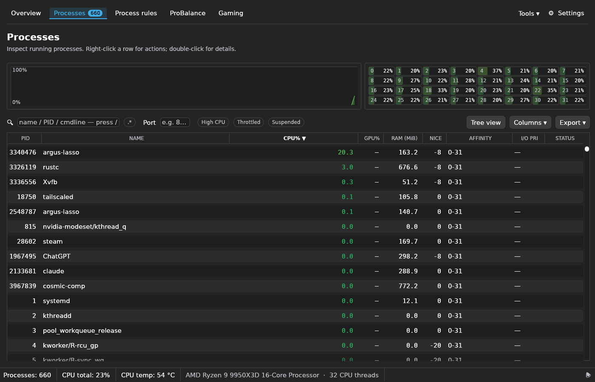
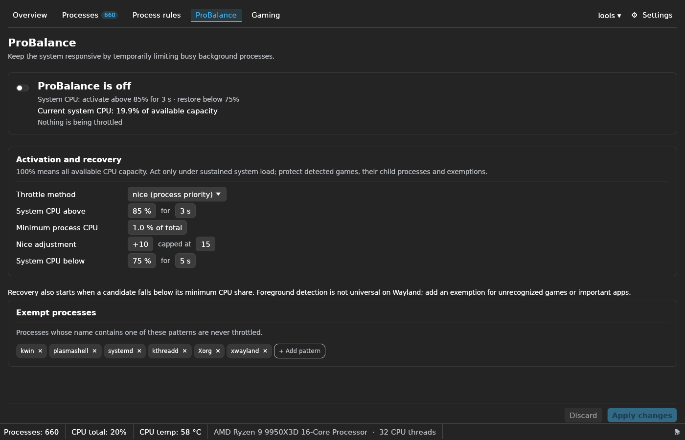
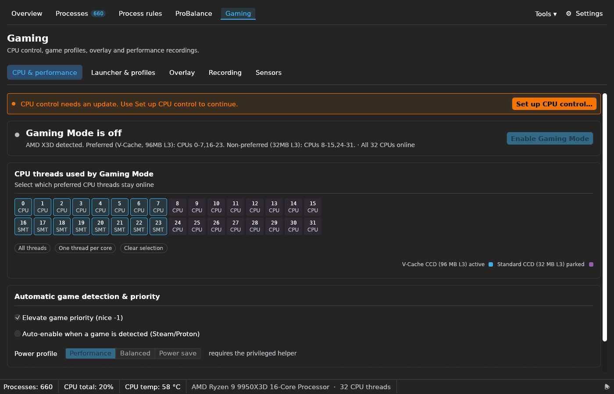
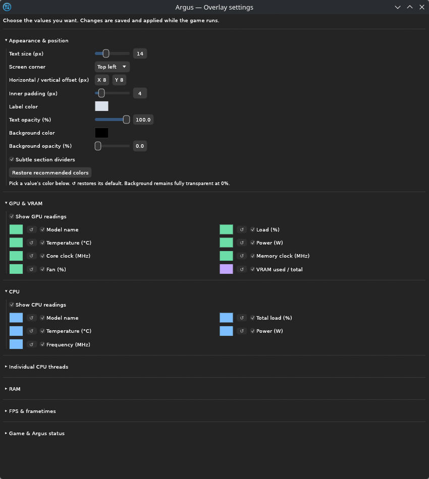
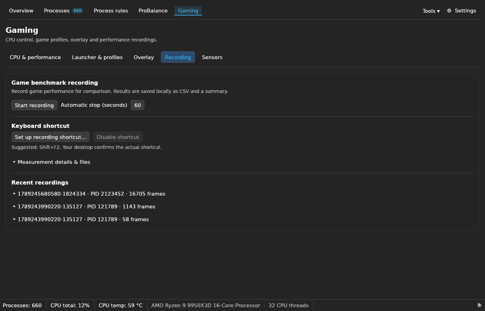
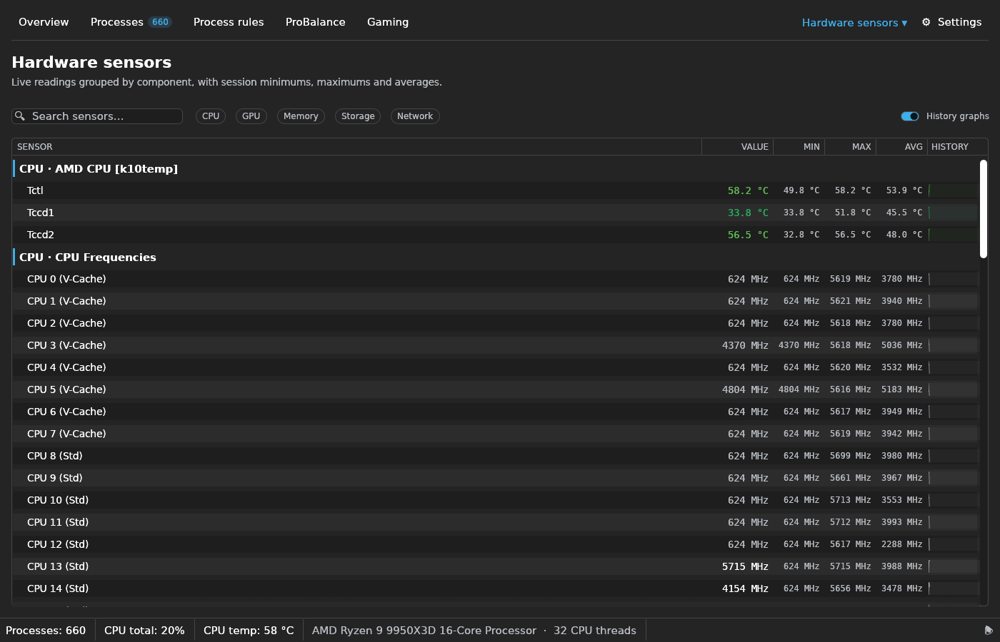
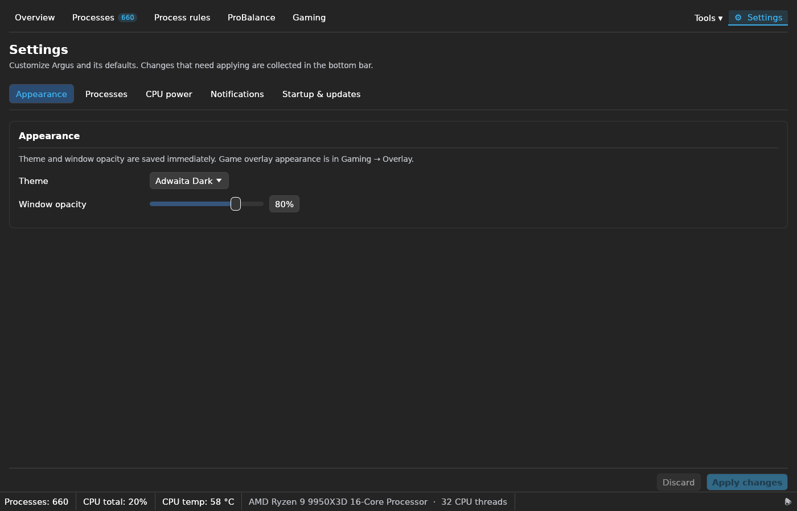

# Argus-Lasso

[](https://github.com/franzjeger/argus-lasso/actions/workflows/ci.yml)
[](https://github.com/franzjeger/argus-lasso/actions/workflows/audit.yml)
[](https://github.com/franzjeger/argus-lasso/releases/latest)

A Linux process manager and gaming toolkit, written in Rust with egui. Manage CPU
assignments and process priorities, inspect hardware sensors, customize a Vulkan
HUD, and record game present intervals for performance comparisons.



**Updated screenshots: September 13, 2026.** [Browse every main menu and settings section](docs/screenshots.md).

**This README describes the current source tree.** The latest published release,
v1.3.1, predates the overlay, recording and navigation work documented here. Build
from source for these features. The repository was renamed from
`process-lasso-linux-rs`; GitHub redirects the old address.

[Install](docs/installation.md) · [User guide](docs/user-guide.md) ·
[All menus and screenshots](docs/screenshots.md) ·
[Overlay and measurements](docs/overlay.md) · [Sensor access](docs/sensors.md) ·
[Development](CONTRIBUTING.md) · [Changelog](CHANGELOG.md)

## What it does

| Area | Available now |
|---|---|
| **Overview** | CPU, RAM, disk and network activity, load averages and busy processes. |
| **Processes** | Sort/filter live processes, inspect details, pause/resume, end processes, change CPU affinity, nice and disk I/O priority, export CSV/JSON. |
| **Process rules** | Persistent affinity and priority rules; exact, substring or regex matching; templates, profiles and JSON import/export. |
| **ProBalance** | Act above 85% overall CPU load, select eligible CPU users separately, and restore below 75%. Detected games/exemptions are protected. |
| **Gaming** | CPU topology/parking, Steam and Lutris launchers, profiles, overlay customization, frame recording and optional extended sensors. |
| **Hardware sensors** | Available hwmon, procfs, NVML and powercap readings with session minimum, maximum, average and history. |
| **Memory benchmarks** | Pointer-chase latency and sequential read/write/copy bandwidth tests. Separate from game recording. |
| **Settings** | Appearance, process defaults, CPU power policy, notifications, startup and update checks. |

The app has Breeze and Adwaita light/dark themes, native movable secondary windows,
a system tray, desktop notifications and persistent configuration. Some actions
need system authentication; the GUI and Vulkan layer run as the normal user.

## In-game overlay

- Transparent background by default, 14 actual screen-pixel text, adjustable
  10–24 px, screen corner, offsets, padding and independent text/background opacity.
- Per-reading colors, a component palette, section dividers and individual field
  switches. Configure under **Gaming → Overlay → Customize overlay**; changes
  reach a compatible running layer without a game restart.
- GPU/VRAM and CPU/RAM readings where available, including logical CPU IDs,
  individual load/frequency, optional physical core IDs and configured RAM speed.
- FPS, frametime, average and 1% low; a five-second graph with its own refresh
  cadence, independent of text and sensor updates.
- Application/PID, launcher profile, actual main-thread affinity, nice level,
  parked-thread count and ProBalance intervention.
- Versioned IPC, build diagnostics and explicit disconnected/stale states.
  Missing sensor readings are not shown as measured zeroes.

For one Steam game, set its launch option to:

```text
ARGUS_LASSO_HUD=1 %command%
```

Alternatively enable **Load in all Vulkan games** in Gaming → Overlay. Changes to
layer loading or its binary take effect on the next game launch. Appearance and
field choices update live. See [overlay setup and limitations](docs/overlay.md).

## Game recording

Use **Gaming → Recording** to start/stop a capture and choose an automatic stop
from 5 to 600 seconds. Set up the desktop-authorized global shortcut there
(suggested **Shift+F2**), or use:

```bash
argus-lasso record --seconds 60
```

Every accepted Vulkan present interval is recorded; disk I/O happens on a worker.
CSV, metadata and summaries are saved privately under
`~/.local/share/argus-lasso/benchmarks`. Loss or write failures mark a result
incomplete. These are **CPU present intervals**, not GPU execution time or
verified displayed/generated-frame timing. See [metric definitions](docs/overlay.md#recording-metrics).

## Quick start from source

Requires Rust **1.92 or newer**, a Linux graphics stack, Wayland/X11 development
libraries, `pkg-config`, `glslangValidator`, Python 3, and systemd user services
for the supplied installer. Full distro dependencies and manual instructions are
in [installation](docs/installation.md).

```bash
git clone https://github.com/franzjeger/argus-lasso.git
cd argus-lasso
make install
make enable  # optional: start with the desktop session
```

Extended sensor access is optional:

```bash
./scripts/install-sensors.sh
```

Then activate **Gaming → Sensors → Enable extended sensor access**. On the tested
Ryzen 9 9950X3D system this provided package power and configured RAM speed
(8000 MT/s). Hardware, firmware and permissions determine what is available;
root is not a guarantee of sensor support. [Details and data sources](docs/sensors.md).

## Compatibility and validation

The current layer was tested with native Vulkan on KDE Wayland, including a
Vulkan application inside SteamLinuxRuntime_sniper, with NVIDIA RTX 5090 and
Ryzen 9 9950X3D hardware. Synchronization validation and independent CSV statistic
checks were run. Native microbenchmarks compare layer-off, loaded-without-drawing
and full-HUD cases; they are **not** a controlled Path of Exile 2 result.

DXVK (DX9/10/11) and VKD3D-Proton (DX12) are Vulkan paths the layer is intended to
work with, but those individual game paths are not yet verified with this build.
There is no 32-bit layer package or OpenGL/WineD3D overlay implementation.
The GPU/driver test matrix remains limited. [Tested, implemented and pending](docs/overlay.md#validation-status).

## Current app screenshots

Captured from the installed current build. Click an image to view it at full size.
The [complete gallery](docs/screenshots.md) includes all main pages and the Gaming
and Settings subsections.

| ProBalance: system-load activation | Gaming: CPU & performance |
|---|---|
|  |  |
| **Overlay customization** | **Game recording** |
|  |  |
| **Hardware sensors** | **Appearance settings** |
|  |  |

CPU usage is shown consistently as **0–100% of available capacity**. On 32 online
logical CPUs, one fully busy CPU contributes 3.125% to the total. ProBalance's
85% threshold applies to the entire system, with a separate minimum share for
candidate processes. [Calculation and policy details](docs/user-guide.md#probalance).

## Configuration and CLI

Configuration: `~/.config/argus-lasso/config.toml`. Overlay choices and appearance
save live; other forms use **Apply changes**. Existing configuration under the
old `process-lasso-rs` directory is migrated when appropriate.

```bash
argus-lasso --minimized              # start hidden to tray
argus-lasso --no-tray                # run without the tray
argus-lasso status --top 10          # JSON snapshot
argus-lasso set-affinity 1234 '0-7'   # Linux logical CPU IDs
argus-lasso kill 1234                # SIGTERM; --force uses SIGKILL
RUST_LOG=debug argus-lasso           # diagnostics
```

The process-table Delete action has an undo countdown. The CLI kill command does
not. File dialogs use `kdialog`, `zenity` or `qarma`; Lutris scanning uses `sqlite3`.

## License

MIT. See [LICENSE](LICENSE). Bundled fonts retain their license in
[assets/fonts/LICENSE](assets/fonts/LICENSE).
