# Screenshot gallery

Main pages captured from the polished source in an isolated X11/Xvfb session,
2026-09-19, using the read-only `--ui-tour` with real host readings and existing
configuration. Sensor warmup can leave early history empty. Numbers
are snapshots, not performance claims. Some pages scroll to additional controls.
The tour does not apply policies or populate an activity log with invented events.

Main-window captures are framebuffer images: compositor-applied desktop opacity
is not baked into them. The native customization image is retained from KDE Wayland on 2026-09-13
and shows the actual controls at 100% window opacity. This gallery covers all main pages
and Gaming/Settings subsections; it does not depict every transient context menu,
expanded sensor group or process-action confirmation.

## Overview

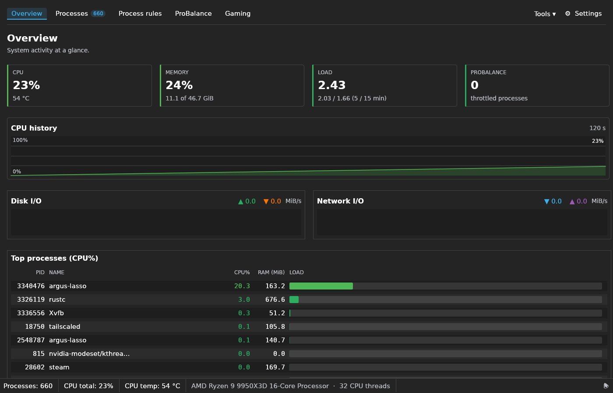

## Processes

## Process rules

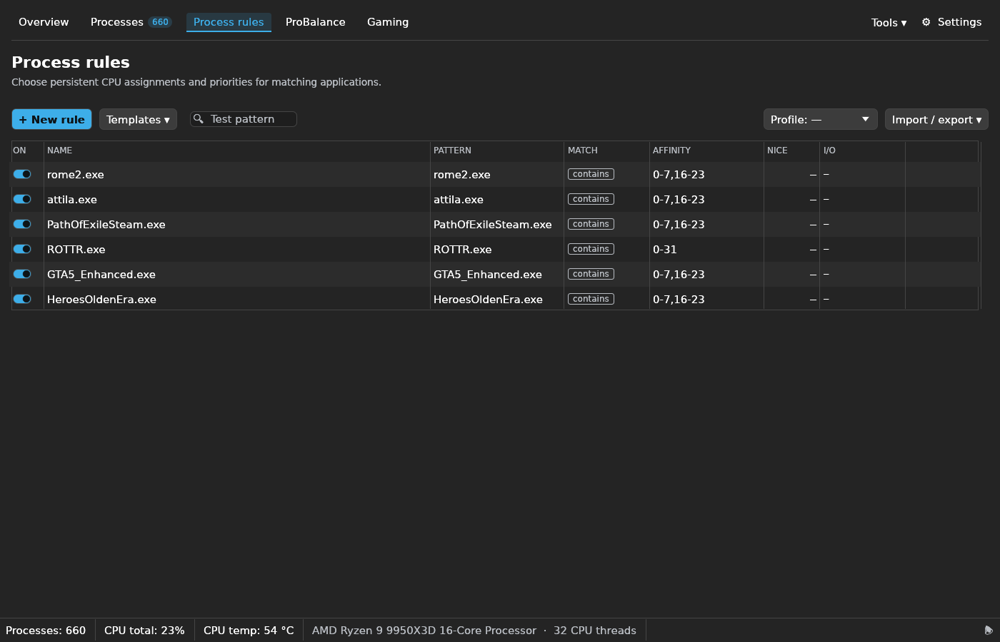

## ProBalance

## Gaming — CPU & performance

## Gaming — Launcher & profiles

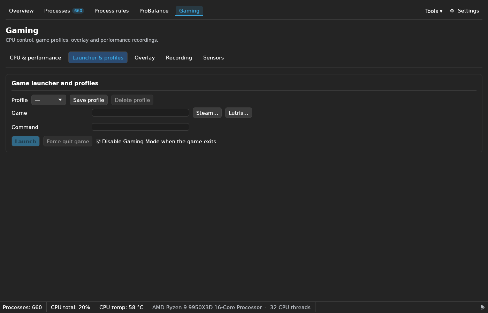

## Gaming — Overlay

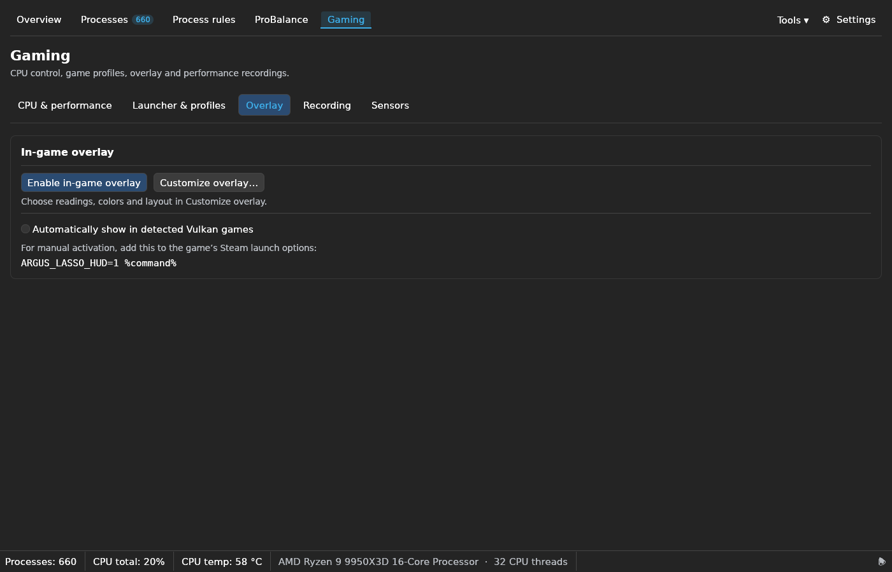

## Gaming — Recording

## Gaming — Sensors

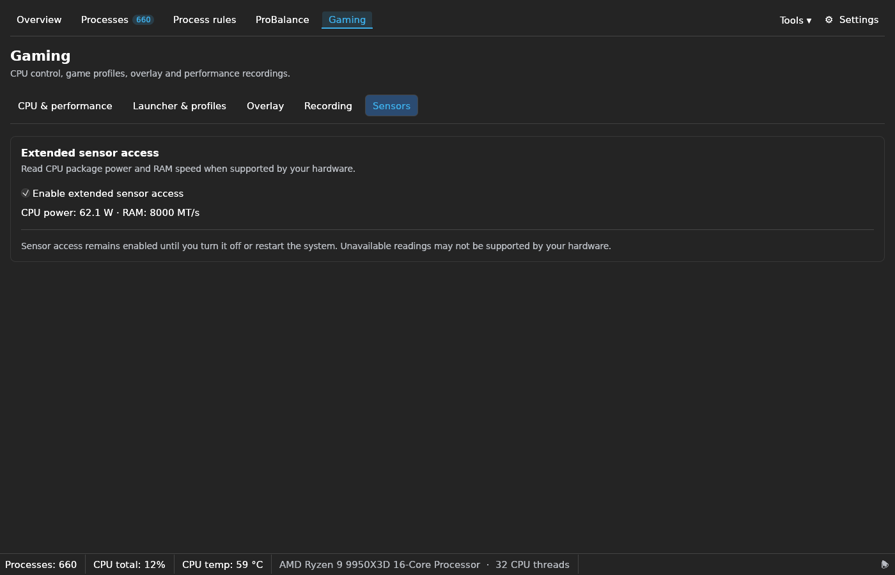

## Settings — Appearance

## Settings — Processes

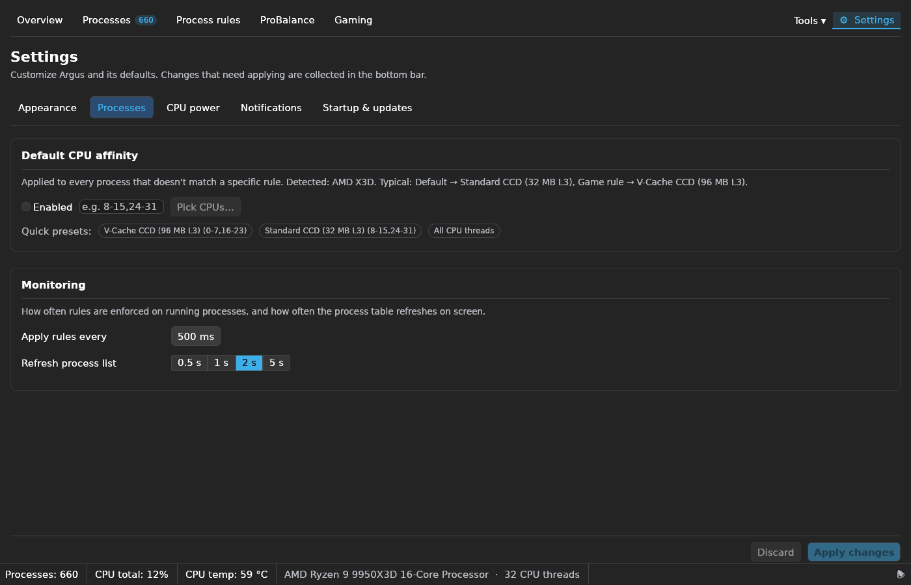

## Settings — CPU power

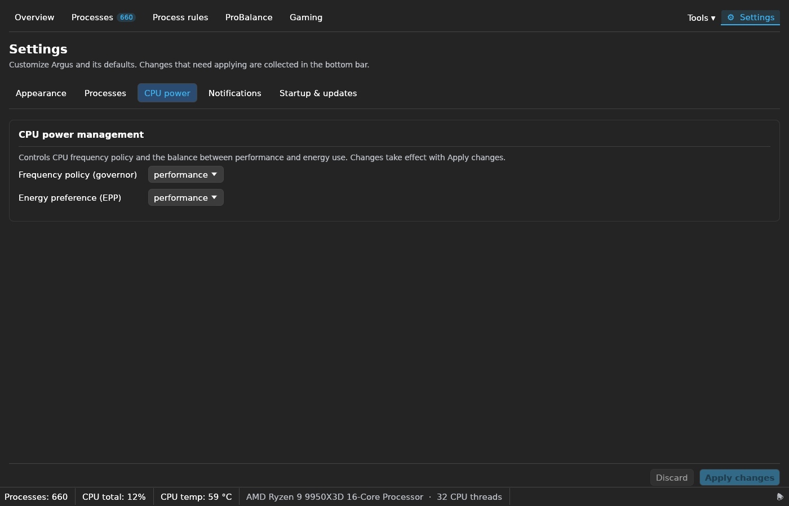

## Settings — Notifications

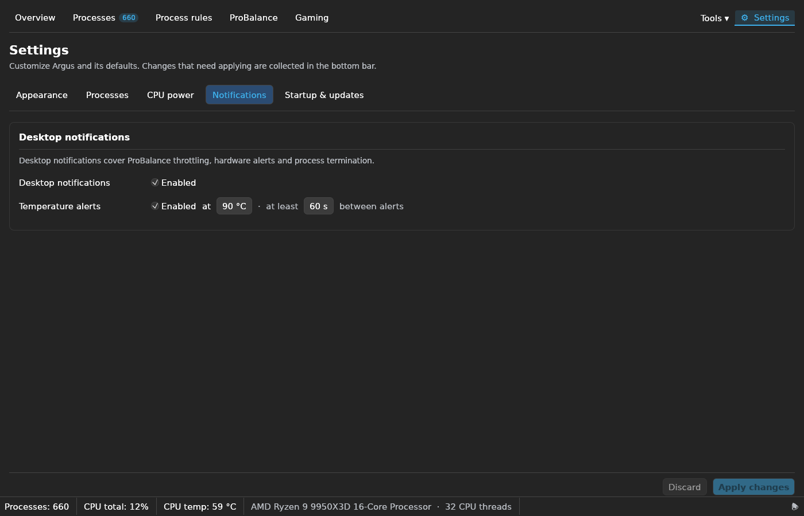

## Settings — Startup & updates

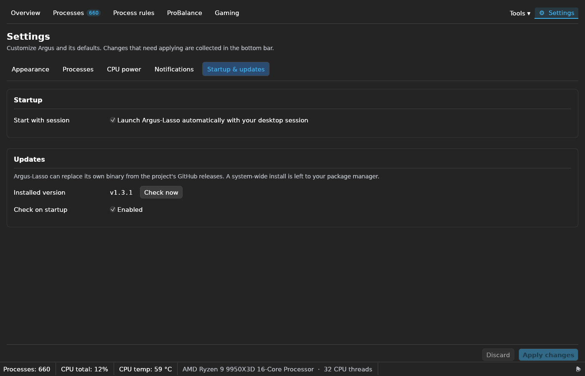

## Tools — Hardware sensors

## Tools — Memory benchmarks

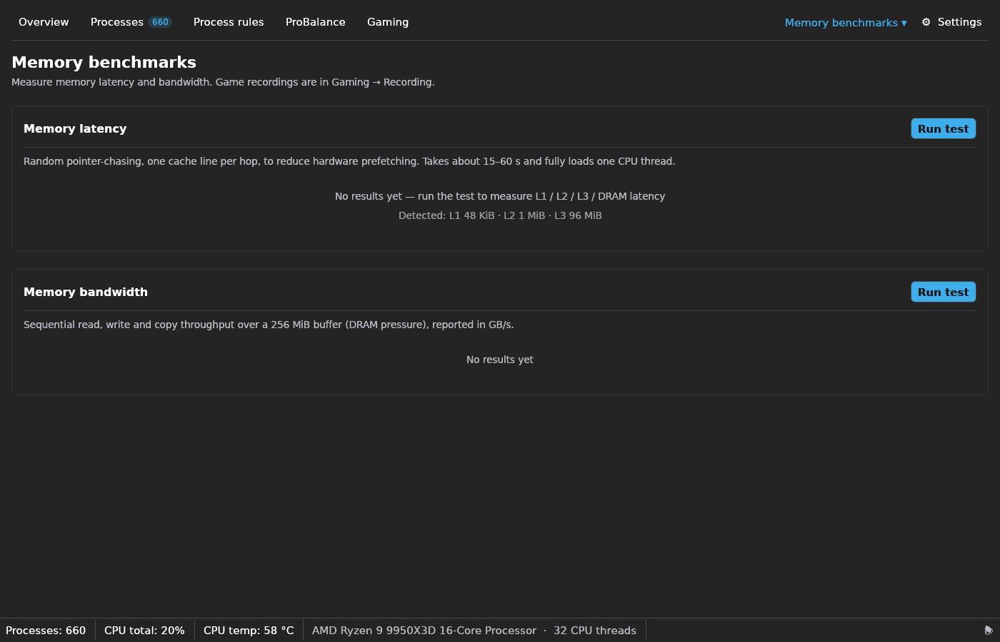

## Tools — Activity log

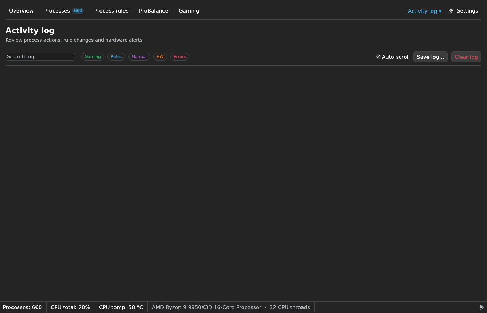

## Overlay customization — separate window

Per-value colors, independent background opacity, actual-pixel text sizing and
expandable CPU, RAM, frame-time and Argus sections. Expand each section to choose
its individual fields and colors.

## Light-theme overlay controls

Captured 2026-09-19 with the isolated preview’s `--light --embedded` mode.
This verifies text hierarchy and contrast; the embedded window does not test
native window decorations or compositor transparency.

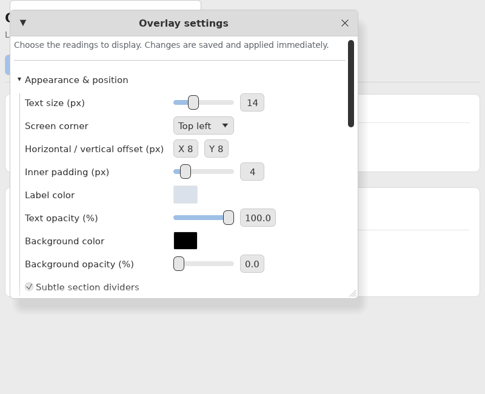
